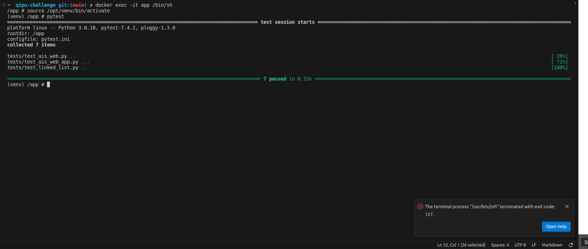
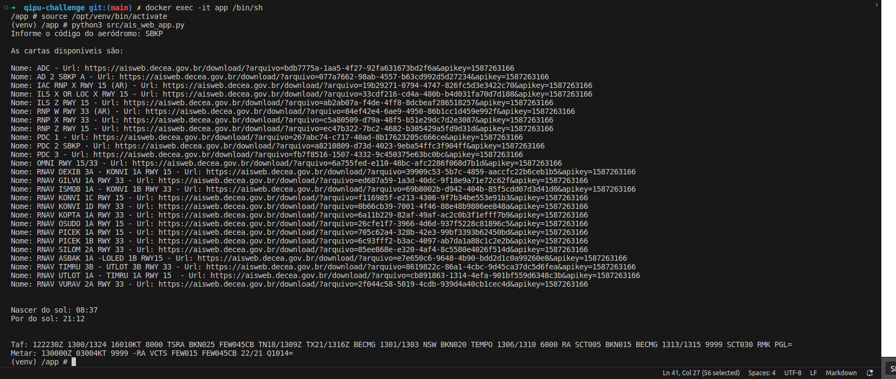

# QIPU Challenge

## Requirements
- docker >= 24.0.6
- docker compose >= v2.20.2-desktop.1


## Challenge 1
Implementação de uma lista encadeada ou lista ligada

## Challenge 2
Para todo aviador, é vital saber antes de qualquer vôo as condições meteorológicas dos aeródromos de partida ou de chegada, assim como a existência de cartas disponíveis e horários de nascer e pôr do sol. No Brasil, estas informações são disponibilizadas pelo site https://www.aisweb.aer.mil.br/.  Nesta página é possível encontrar links para cartas, horarios do sol e as informações de TAF e METAR, que são boletins meteorológicos codificados.

Escreva um código que leia no terminal o código ICAO qualquer de um aeródromo (SBMT = campo de marte, SBJD = aeroporto de jundiaí, etc...) e imprima na tela:

- As cartas disponíveis
- Os horários de nascer e pôr do sol de hoje
- A informação de TAF e METAR disponíveis

## Setup
```
sudo cp .env.example .env
docker compose up -d --force-recreate --no-deps --build
docker exec -it app /bin/sh
source /opt/venv/bin/activate
```

## Running tests
```
docker exec -it app /bin/sh
source /opt/venv/bin/activate
pytest
```
### Output tests


## Run challenge 2
```
docker exec -it app /bin/sh
source /opt/venv/bin/activate
python3 src/ais_web_app.py
```

### Output challenge 2
